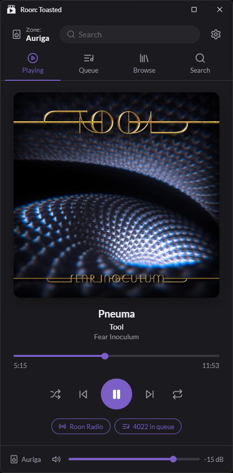

# Roon: Toasted

A Roon companion for Windows that lives in the tray. Press a hotkey to open a
small player with now playing, your queue, browse and search, get a "now
playing" toast when the track changes, or put a mini player on your taskbar.
It works on its own, no Stream Deck needed, and pairs with
[Roon: Dialed Up](https://marketplace.elgato.com/product/roon-dialed-up-f76699d9-4266-4d4a-ad94-eaddd148daa9)
if you have a Stream Deck.

<p align="center">
  
</p>

## Features

- **The Toaster:** now playing, queue, browse and search for any zone, with
  playback, volume, shuffle, repeat, Roon Radio and zone controls. Opens from
  the tray, a hotkey, or a `roon-toasted://` link.
- **Now-playing toasts** when the track changes, in the corner and on the
  monitor you choose, for as long as you like (2 to 30 seconds). Click one to
  open the Toaster. They stay out of the way of full-screen games.
- **Global hotkeys:** Ctrl + Alt + Z opens (or hides) the Toaster,
  Ctrl + Alt + S opens it on Search. Both can be changed or turned off.
- **Taskbar widget** (experimental): a small player on your main taskbar with
  art, title, artist and playback buttons. Choose the side, position, width and
  one or two lines of text.
- **Album Art colors:** the Toaster, toasts and widget can take their colors
  from the album that's playing.
- **Auto-Hide:** the Toaster goes back to the tray when you click elsewhere
  (or stays on the taskbar if you turn that off).
- Tray quick settings, Start with Windows, zoom, light and dark themes, and a
  window that fits your screen.

## Install

1. Download the latest installer from the
   [Releases page](https://github.com/Vulkandr/roon-toasted/releases) and run
   it. It installs for your user only and doesn't need administrator rights.
2. Start Roon: Toasted. It appears in the tray, and Settings opens the first
   time to help you connect.
3. In Roon, go to **Settings > Extensions** and enable **Roon: Toasted**. That's
   all the setup there is.
4. Double-click the tray icon (or press Ctrl + Alt + Z) to open the Toaster.

To uninstall, use **Apps & Features** in Windows, or run the installer again
and choose to uninstall. The uninstaller has an unticked checkbox to also delete
the app's settings.

### Windows may warn you

The installer isn't code-signed yet (a certificate costs money, and this is a
free hobby project), so:

- **SmartScreen** may say "Windows protected your PC". Choose **More info**,
  then **Run anyway**.
- Some antivirus programs flag new, unsigned apps by mistake. If yours does,
  the full source is right here to inspect, and you can allow the app or build
  it yourself (see below).

### Requirements

- Windows 11 (built and tested there). Windows 10 should work but hasn't been
  tested, and doesn't get rounded corners.
- A Roon Core on your network (Roon 2.x).
- Mac and Linux aren't supported, may be added later.

## Stream Deck

Do you have a Stream Deck? **Roon: Dialed Up** puts Roon on your Stream Deck
buttons and dials, and can open the Toaster (or Search) from a button when
Roon: Toasted is installed:
[Roon: Dialed Up on the Elgato Marketplace](https://marketplace.elgato.com/product/roon-dialed-up-f76699d9-4266-4d4a-ad94-eaddd148daa9).

### Links for other apps

Other apps can open the Toaster with these links:

| Link | What it does |
|---|---|
| `roon-toasted://toggle` | Opens the Toaster, or hides it if it's open and in front |
| `roon-toasted://open` | Opens the Toaster on the Playing tab |
| `roon-toasted://search` | Opens the Toaster on Search, ready to type |

The app registers these links for the current user every time it starts.

### Status check for other apps

While Roon: Toasted is running, `http://127.0.0.1:58421/status` (this PC only)
answers with JSON, so other apps can tell it's running:

```json
{ "app": "Roon: Toasted", "version": "1.0.0", "roon": "connected", "core": "Roon Optimized Core Kit" }
```

`roon` is `connected`, `searching` or `reconnecting`; `core` is the Core's name
once connected, otherwise `null`. No answer means it isn't running.

## Good to know

- Roon doesn't share everything with extensions. There's no audio quality or
  signal path info, no queue reordering or clearing, and no way to open a
  specific page in the Roon app, so Roon: Toasted doesn't show or do those.
- Toasts are skipped while a game runs in exclusive full-screen mode, because
  showing one would minimize the game. Borderless windowed games get them.
- The taskbar widget is experimental. Windows doesn't officially allow apps to
  add to the taskbar, so the widget floats over it and may misbehave, for
  example after a display change.
- Roon: Toasted only talks to your Roon Core on your own network. The status
  check only answers on your own PC.

## Building

Needs [Rust](https://rustup.rs), [Node.js](https://nodejs.org) and the
Microsoft C++ Build Tools.

```
npm install
npm run tauri dev      # run it while developing
npm run tauri build    # build the installer (src-tauri/target/release/bundle/nsis)
```

Run it from a normal (not administrator) terminal. Some antivirus programs
quarantine Rust build scripts by mistake; if a build hangs or fails oddly,
allow the `src-tauri/target` folder.

App icons are generated from `branding/app-icon-1024.png` with `npx tauri icon`;
`src-tauri/icons/icon.ico` and `tray.ico` also use the simplified drawing
(`branding/app-icon-small-1024.png`, `branding/logo-mask-small-1024.png`) at
small sizes.

## License

Roon: Toasted is licensed under the [Mozilla Public License 2.0](LICENSE).
In short, you can use, change and share it, including inside larger projects
under other licenses; if you share changed versions of these source files, those
files stay under the MPL.

If the Roon team would like to use any part of this project, whether the code
or just the ideas, I'd be glad to hear from you. Get in touch through my GitHub
profile ([Vulkandr](https://github.com/Vulkandr)) and we can work out terms
that suit you.

## Credits

- Built with [Tauri](https://tauri.app) (MIT or Apache-2.0).
- Roon connection: [roon-api and roon-sood](https://github.com/shin1ohno/roon-rs)
  by shin1ohno (MIT or Apache-2.0). Patched copies of both are included in
  `src-tauri/vendor` under their own licenses; see `VENDORED.md` in each folder
  for the changes.
- Icons in the interface: [Lucide](https://lucide.dev) (ISC license).
- Fonts: [Gloock](https://fonts.google.com/specimen/Gloock),
  [Lato](https://fonts.google.com/specimen/Lato) and
  [Noto Sans](https://fonts.google.com/noto/specimen/Noto+Sans), all under the
  SIL Open Font License 1.1 (license files in `src/assets/fonts`), packaged by
  [Fontsource](https://fontsource.org).

Roon is a trademark of Roon Labs LLC. Roon: Toasted is an independent project,
not made or endorsed by Roon Labs.
